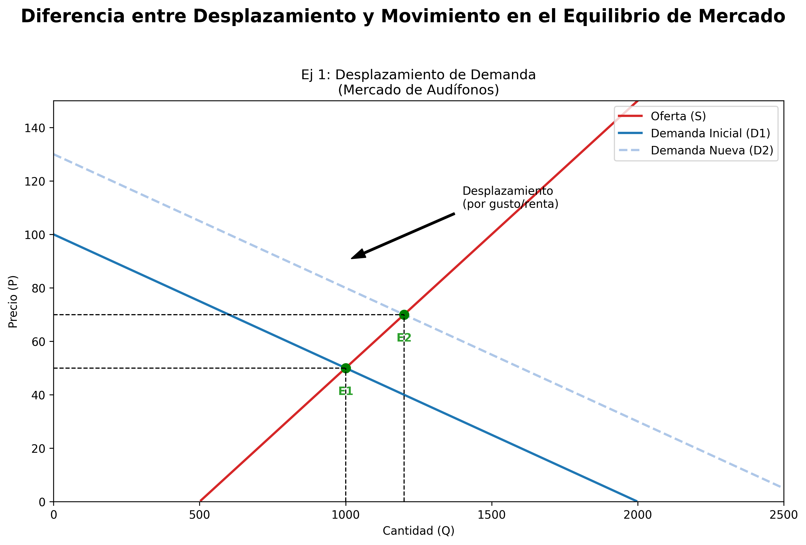
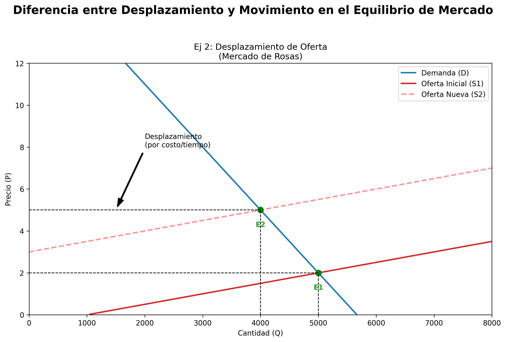
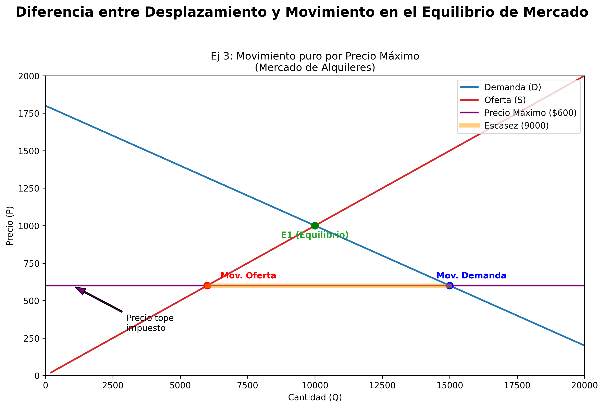
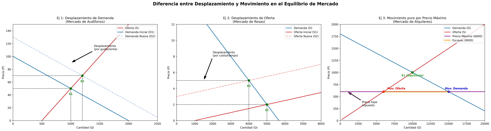

# Semana 1 · Sesión 2: Profundización

## 5. El Equilibrio de Mercado

El mercado es el lugar (físico o virtual) donde compradores y vendedores interactúan. 

* **Equilibrio:** Es el punto donde la cantidad demandada es exactamente igual a la cantidad ofrecida ($Q_d = Q_s$). En este punto, no hay escasez ni excedente. La economía se "limpia" a sí misma (Market Clearing).
* **Escasez (Falta de oferta):** Si el precio es menor al de equilibrio, la cantidad demandada supera a la ofrecida. Los compradores harán colas y los productores subirán el precio.
* **Excedente (Falta de demanda):** Si el precio es mayor al de equilibrio, la cantidad ofrecida supera a la demandada. Habrá estantes llenos de inventario y los productores deberán bajar el precio o hacer descuentos.

---

## 6. Movimientos vs. Desplazamientos (¡Cuidado con esto!)

Es el error más común en estudiantes de economía:

* **Cambio en la Cantidad Demandada (Movimiento a lo largo de la curva):** Ocurre **Únicamente** por un cambio en el precio del propio bien.
* **Cambio en la Demanda (Desplazamiento de la curva):** Ocurre por un cambio en cualquiera de los "Determinantes" mencionados arriba (ingresos, gustos, etc.). Toda la curva se mueve a la izquierda (menos demanda) o a la derecha (más demanda).
*(Lo mismo aplica para la oferta).*

---

Para entender la diferencia entre **movimiento** y **desplazamiento** en el contexto del **equilibrio de mercado**, primero debemos clarificar dos reglas básicas en economía:

1.  **Desplazamiento de la curva:** Ocurre cuando cambia un factor *diferente* al precio del bien. Implica que a cualquier precio, la cantidad demandada u ofrecida es distinta. Cambia toda la curva (hablamos de un cambio en la *Demanda* o en la *Oferta*).
2.  **Movimiento a lo largo de la curva:** Ocurre *únicamente* cuando cambia el precio del bien. Implica pasar de un punto a otro de la misma curva (hablamos de un cambio en la *cantidad demandada* o *cantidad ofrecida*).

En el equilibrio de mercado, un **desplazamiento** es la causa que rompe el equilibrio inicial, y el **movimiento** es el ajuste del mercado para encontrar un nuevo equilibrio.

A continuación, te lo explico con tres ejemplos prácticos.

---

### Ejemplo 1: Desplazamiento de la Demanda y Movimiento en la Oferta
**El mercado de los audífonos inalámbricos**

*   **Equilibrio Inicial:** El mercado está en equilibrio. Se venden 1,000 audífonos al mes a un precio de $50 (Punto E1).
*   **El Desplazamiento:** Un avance tecnológico hace que los audífonos normales con cable se vuelvan obsoletos y la gente ya no los quiere. Al mismo tiempo, suben los ingresos de los consumidores. Estos factores (gustos y renta) hacen que la **curva de demanda se desplace hacia la derecha**. Ahora, a cualquier precio, la gente quiere comprar más audífonos inalámbricos. A $50, ahora la gente quiere comprar 1,500, pero los productores solo siguen fabricando 1,000. Se crea una escasez temporal.
*   **El Movimiento:** Ante esta escasez, el precio empieza a subir. Al subir el precio de $50 a $70, los productores están dispuestos a fabricar más. Aquí ocurre un **movimiento a lo largo de la curva de oferta** (de 1,000 a 1,200 unidades). Al mismo tiempo, el precio más alto hace que algunos consumidores se salgan del mercado, lo que genera un **movimiento a lo largo de la nueva curva de demanda** (de 1,500 a 1,200 unidades).
*   **Nuevo Equilibrio (E2):** El mercado se estabiliza en un precio de $70 y una cantidad de 1,200 audífonos.
*   **Resumen:** El cambio en los gustos *desplazó* la demanda. El aumento del precio causó un *movimiento* en la oferta.

<figure markdown="span">

  
  <figcaption>Equilibrio de Mercado</figcaption>
</figure>

---

### Ejemplo 2: Desplazamiento de la Oferta y Movimiento en la Demanda
**El mercado de las rosas para el Día de San Valentín**

*   **Equilibrio Inicial:** Supongamos que es enero. El mercado de las rosas está en equilibrio en E1: 5,000 rosas vendidas a $2 cada una.
*   **El Desplazamiento:** Llega febrero y se acerca el Día de San Valentín. Los floricultores saben que la demanda será masiva, pero para asegurar que haya suficientes rosas para esa fecha específica, contratan más trabajadores y gastan más en invernaderos. Estos costos de producción aumentan antes de la fecha. Por lo tanto, la **curva de oferta se desplaza hacia la izquierda** (a cualquier precio, hay menor cantidad disponible de forma inmediata).
*   **El Movimiento:** Al haber menos rosas disponibles a $2, se genera una escasez. El precio de las rosas sube drásticamente a $5. Frente a este precio de $5, los consumidores deciden comprar menos rosas o cambiar a otros regalos. Aquí ocurre un **movimiento a lo largo de la curva de demanda** (la cantidad demandada cae de 7,000 a 4,000 unidades). Los productores, a su vez, tienen un **movimiento a lo largo de la nueva curva de oferta** (suben su producción entregada de 3,000 a 4,000 para aprovechar el alto precio).
*   **Nuevo Equilibrio (E2):** El precio sube a $5 y la cantidad de equilibrio baja a 4,000 rosas.
*   **Resumen:** El costo / preparación temporal *desplazó* la oferta. El nuevo precio más alto causó un *movimiento* en la demanda.

<figure markdown="span">

  
  <figcaption>Equilibrio de Mercado</figcaption>
</figure>

---

### Ejemplo 3: El "ceiling price" (Precios máximos) - Movimiento puro sin desplazamiento
**El mercado de los departamentos en alquiler**

A veces, el gobierno interviene. Esto es extremo, pero ejemplifica la diferencia perfectamente.

*   **Equilibrio Inicial:** El alquiler promedio en una ciudad es de $1,000 (E1) y hay 10,000 departamentos rentados. La oferta y la demanda no se desplazan.
*   **Intervención:** El gobierno, para ayudar a la clase media, establece una ley que prohíbe a los dueños cobrar más de $600 por alquiler.
*   **El Movimiento:** Como el precio bajó de $1,000 a $600 por orden del gobierno, ocurren dos movimientos simultáneos sobre las curvas *originales* (no se desplaza ninguna curva):
    1.  **Movimiento a lo largo de la curva de demanda:** Como los alquileres están a $600, más personas quieren independizarse y alquilar. La cantidad demandada aumenta a 15,000.
    2.  **Movimiento a lo largo de la curva de oferta:** Como los dueños ganan menos (solo $600), muchos deciden convertir sus departamentos en Airbnbs, venderlos, o no darles mantenimiento. La cantidad ofrecida cae a 6,000.
*   **Desequilibrio:** Hay una escasez de 9,000 departamentos (15,000 demandados vs 6,000 ofrecidos).
*   **Resumen:** En este caso, el factor externo (precio regulado) sólo provocó *movimientos* sobre las curvas de oferta y demanda, sin *desplazar* ninguna. El mercado original se quedó exactamente donde estaba, solo cambiaron las cantidades por dictate legal.

<figure markdown="span">

  
  <figcaption>Equilibrio de Mercado</figcaption>
</figure>

---

<figure markdown="span">

  
  <figcaption>Equilibrio de Mercado</figcaption>
</figure>

### Conclusión para recordarlo fácilmente:
*   **Desplazamiento** = Romance. La curva "se muda" de su lugar habitual porque algo externo cambió (moda, ingresos, tecnología, impuestos). **Rompe el equilibrio.**
*   **Movimiento** = Danza. Bailas de un lado a otro **sobre la misma curva** porque el precio subió o bajó. **Es el mecanismo de reacción hacia un nuevo equilibrio.**