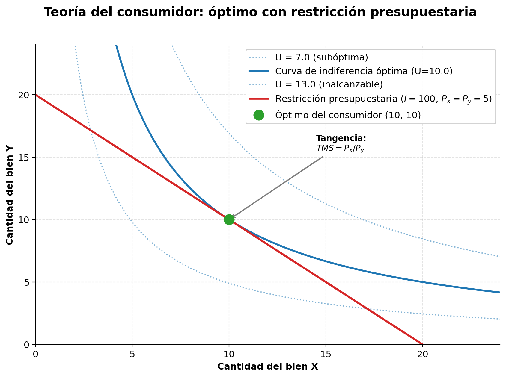

# Semana 2 · Sesión 1: Fundamentos

## 1. Objetivos de la Semana
* Comprender cómo los consumidores toman decisiones de maximización de utilidad sujetos a una restricción presupuestaria.
* Entender el concepto de Utilidad Marginal Decreciente.
* Calcular e interpretar las elasticidades (Precio, Ingreso y Cruzada) y su impacto directo en los ingresos de una empresa.
* Analizar factores psicológicos y de comportamiento que afectan la demanda.

---

## 2. Teoría del Consumidor: La Elección Racional
La teoría económica asume que los consumidores son racionales y buscan maximizar su **utilidad** (satisfacción) con el dinero del que disponen.

**A. La Restricción Presupuestaria (Línea de Presupuesto):**
El consumidor no puede comprar todo. Su límite es su ingreso ($I$) y los precios de los bienes ($P_x$ y $P_y$).
* **Ecuación:** $I = P_x \cdot X + P_y \cdot Y$
* Si el precio de un bien sube, la línea de presupuesto se inclina hacia adentro (puedes comprar menos). Si tu ingreso sube, la línea se desplaza paralelamente hacia afuera (puedes comprar más).

**B. Curvas de Indiferencia:**
Son gráficas que muestran combinaciones de dos bienes que le otorgan al consumidor *exactamente la misma utilidad*. El consumidor es indiferente entre cualquier punto de esa curva. Tienen pendiente negativa (para mantener la misma utilidad, si consumes más de un bien, debes consumir menos del otro) y son convexas hacia el origen.

<figure markdown="span">
  
  <figcaption>El óptimo del consumidor: la curva de indiferencia más alta alcanzable es tangente a la recta de presupuesto</figcaption>
</figure>

**C. La Utilidad Marginal Decreciente:**
La *Utilidad Total* es la satisfacción acumulada. La *Utilidad Marginal (UMg)* es la satisfacción adicional que obtenemos al consumir **una unidad más** de un bien.
* **La Ley:** A medida que consumes más unidades de un mismo bien, la satisfacción que te aporta cada unidad adicional es menor. 
* *Ejemplo:* El primer vaso de agua cuando tienes mucha sed da muchísima satisfacción. El segundo da bastante. El quinto vaso te da náuseas (utilidad marginal negativa).

**D. La Equimarginalidad (Maximización de la Utilidad):**
El consumidor maximiza su utilidad cuando gasta su último dólar de manera que la utilidad marginal por dólar gastado sea igual en todos los bienes:
$$ \frac{UMg_x}{P_x} = \frac{UMg_y}{P_y} $$
En pocas palabras: si un cafélito te da más satisfacción por dólar gastado que un croissant, comprarás más café y menos croissants hasta que ambas relaciones se igualen.

---

## 3. Elasticidad: Midiendo la Sensibilidad
La elasticidad mide **qué tan sensible** es la cantidad demandada u ofrecida ante un cambio en una de sus variables (precio, ingresos, etc.). Se calcula como el **cambio porcentual** de la cantidad dividido por el **cambio porcentual** de la variable.

*(Nota: Para evitar errores de cálculo dependiendo de si el precio sube o baja, siempre usamos la fórmula del "punto medio" o "arco" en economía).*

### A. Elasticidad Precio de la Demanda ($E_p$)
Mide cuánto cambia la cantidad demandada cuando cambia el precio del bien.
*   **Fórmula:** $E_p = \frac{\% \Delta \text{Cantidad Demandada}}{\% \Delta \text{Precio}}$
*   *Siempre es negativa* (por la Ley de la Demanda), pero se lee en valor absoluto ($|E_p|$).

**Clasificación de la Demanda según su Elasticidad:**
1. **Inelástica ($|E_p| < 1$):** La cantidad cambia en menor proporción que el precio. Los consumidores no dejan de comprarlo fácilmente. (Ej. Medicinas, sal, gasolina).
2. **Elástica ($|E_p| > 1$):** La cantidad cambia en mayor proporción que el precio. Hay muchos sustitutos. (Ej. Marcas de cereal, ropa de moda).
3. **Unitaria ($|E_p| = 1$):** La cantidad cambia en la misma proporción que el precio.

> **💥 REGLA DE ORO FINANCIERA (La conexión con los Ingresos):**
> *   Si la demanda es **Inelástica** ($<1$) y **subes** el precio, tus **ingresos totales aumentan**.
> *   Si la demanda es **Elástica** ($>1$) y **subes** el precio, tus **ingresos totales disminuyen** (la gente huye masivamente). En este caso, para ganar más ingresos, debes *bajar* el precio.

### B. Elasticidad Ingreso de la Demanda ($E_i$)
Mide cómo cambia la demanda cuando cambia el ingreso del consumidor.
*   **Fórmula:** $E_i = \frac{\% \Delta \text{Cantidad Demandada}}{\% \Delta \text{Ingreso del Consumidor}}$
*   **Clasificación de los bienes:**
    *   **Bienes Normales ($E_i > 0$):** Si sube el ingreso, la demanda sube. (Ej. Ropa, carne de buena calidad).
    *   **Bienes Inferiores ($E_i < 0$):** Si sube el ingreso, la demanda *baja*. El consumidor lo reemplaza por algo mejor. (Ej. Transporte público, fideos instantáneos, marcas blancas básicas).

### C. Elasticidad Cruzada de la Demanda ($E_c$)
Mide cómo cambia la demanda del Bien X cuando cambia el precio del Bien Y.
*   **Fórmula:** $E_c = \frac{\% \Delta \text{Cantidad Demandada de X}}{\% \Delta \text{Precio de Y}}$
*   **Clasificación:**
    *   **Sustitutos ($E_c > 0$):** Si sube el precio del Bien Y (Café), la demanda del Bien X (Té) sube.
    *   **Complementarios ($E_c < 0$):** Si sube el precio del Bien Y (Impresoras), la demanda del Bien X (Cartuchos de tinta) baja.

---

