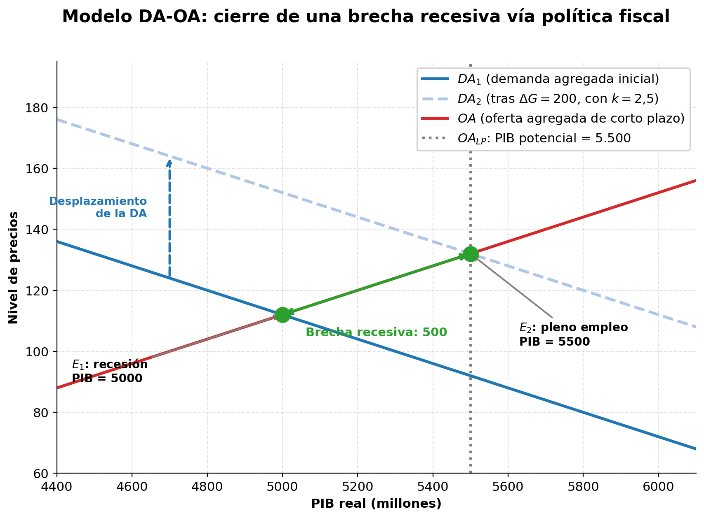

# Semana 5 · Sesión 1: Fundamentos

## 1. Objetivos de la Semana
* Entender el Modelo de Demanda y Oferta Agregada (DA-OA) como marco central del análisis macroeconómico.
* Diferenciar entre la Oferta Agregada a Corto Plazo (OACP) y a Largo Plazo (OALP).
* Comprender la diferencia entre los choques de demanda y los choques de oferta.
* Calcular el efecto multiplicador keynesiano y entender cómo un gasto inicial se amplifica en la economía.

---

## 2. La Demanda Agregada (DA)
La Demanda Agregada representa la cantidad total de bienes y servicios que las familias, las empresas, el gobierno y el resto del mundo están dispuestos a comprar a diferentes niveles de precios en una economía.

* **Fórmula:** Es la misma ecuación del PIB vista la semana pasada: $DA = C + I + G + (X - M)$
* **La Curva de DA tiene pendiente negativa:** Si el nivel general de precios sube, la cantidad demandada de bienes y servicios cae. ¿Por qué? Tres razones:
  1. **Efecto riqueza (Pigou):** Si los precios suben, el dinero que tienes en el banco pierde poder adquisitivo. Te sientes más pobre y reduces tu consumo (C).
  2. **Efecto tasa de interés (Keynes):** Si los precios suben, la gente necesita más dinero en efectivo para sus compras diarias. Vende sus bonos para conseguir efectivo. Al vender muchos bonos, el precio de los bonos baja y las tasas de interés suben. Con tasas más altas, las empresas piden menos préstamos y la inversión (I) cae.
  3. **Efecto tipo de cambio (Mundell-Fleming):** Precios más altos hacen que las exportaciones del país sean más caras para los extranjeros, reduciendo las exportaciones netas (X-M).

* **Desplazamientos de la DA:** La DA se desplaza hacia la derecha (aumenta) si hay: aumento del consumo (ej. baja impuestos), aumento de la inversión (ej. baja tasas de interés), aumento del gasto público, o un boom en exportaciones.

---

## 3. La Oferta Agregada (OA)
Representa la cantidad total de bienes y servicios que las empresas de un país están dispuestas a producir y vender a diferentes niveles de precios. Aquí hay que dividir el análisis entre el corto y el largo plazo.

**A. Oferta Agregada a Largo Plazo (OALP):**
* Es una **línea vertical**. 
* En el largo plazo, la producción de un país (PIB Potencial) está determinada por sus recursos reales: capital, trabajo, recursos naturales y tecnología. El nivel de precios no altera estos fundamentos.
* Representa el PIB de pleno empleo (tasa de desempleo natural).

**B. Oferta Agregada a Corto Plazo (OACP):**
* Tiene **pendiente positiva**. A corto plazo, si suben los precios de venta, a las empresas les conviene producir más porque sus costos (especialmente los salarios) son "rígidos" a la baja y no suben inmediatamente.
* **Choques de Oferta:** Un evento que cambia los costos de producción desplaza la OACP.
  * *Choque adverso (OACP se desplaza a la izquierda):* Sube el precio del petróleo, terremotos, pandemia (cierra fábricas). A corto plazo: **Sube el precio (Inflación) y baja el PIB (Recesión)**. A esto se le llama **Estanflación**.
  * *Choque favorable (OACP se desplaza a la derecha):* Avance tecnológico, buena cosecha agrícola. Baja el precio y sube el PIB.

<figure markdown="span">
  
  <figcaption>Un aumento del gasto público desplaza la DA y cierra la brecha recesiva hasta el PIB potencial</figcaption>
</figure>

---
