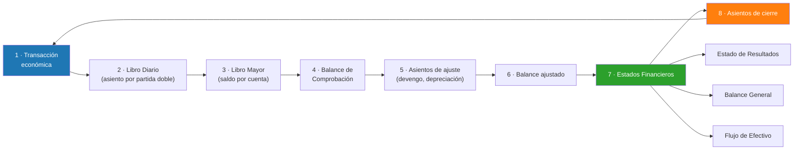

# Semana 7 · Sesión 1: Fundamentos

## 1. Objetivos de la Semana
* Entender y manejar la **Ecuación Contable Básica** (El Activo, Pasivo y Patrimonio).
* Comprender el sistema de **Partida Doble** (Débitos y Créditos) para registrar transacciones.
* Conocer las 5 cuentas contables principales (Activo, Pasivo, Patrimonio, Ingresos, Gastos).
* Entender los pasos del Ciclo Contable, desde que ocurre una transacción hasta el Balance General.

---

## 2. La Ecuación Contable Básica
Toda empresa, sin importar su tamaño, se rige por una fórmula matemática inviolable:

$$ \text{ACTIVO} = \text{PASIVO} + \text{PATRIMONIO} $$

o en su forma en inglés: $A = L + E$ (Assets = Liabilities + Equity).

* **Activo (A):** Es todo lo que la empresa **posee** y que tiene valor económico presente o futuro.
  * *Ejemplos:* Efectivo, dinero en bancos, inventario en la bodega, maquinaria, vehículos, edificios, y cuentas por cobrar (dinero que clientes le deben a la empresa).
* **Pasivo (L):** Es todo lo que la empresa **debe** a terceros.
  * *Ejemplos:* Préstamos bancarios, cuentas por pagar (dinero que la empresa le debe a sus proveedores), impuestos por pagar, salarios pendientes de pago.
* **Patrimonio (E):** Es lo que pertenece a los dueños (accionistas). Es el valor "neto" real del negocio. 
  * *Ejemplo:* Si vendieras todos los activos hoy y pagaras todas las deudas, el sobrante es el patrimonio. Incluye el Capital aportado por los socios y las Ganancias Retenidas (utilidades de años anteriores no repartidas como dividendos).

> **💥 Conexión Financiera:** Si un analista financiero ve que el Activo crece financiándose únicamente con Pasivo (deuda), detecta una empresa muy apalancada y riesgosa. Si crece financiándose con Patrimonio, ve una empresa que se autofinancia o atrae inversores.

---

## 3. La Partida Doble: Débitos y Créditos
Para que la ecuación contable siempre se mantenga en equilibrio, cada vez que ocurre una transacción se deben registrar **al menos dos movimientos** (uno que suma y otro que resta, o dos que suman, etc.). 

> **Regla de Oro Absoluta:** En contabilidad, los términos **Débito (Debe)** y **Crédito (Haber)** NO significan "restar" ni "sumar" de forma universal. Su efecto depende del tipo de cuenta.

**Comportamiento de las cuentas (Memoriza esto):**

| Tipo de Cuenta | Aumenta con un... | Disminuye con un... | Saldo Normal |
| :--- | :---: | :---: | :---: |
| **Activo** (Lo que tienes) | **Débito** (Debitas) | **Crédito** (Acreditas) | **Deudor** |
| **Gasto** (Lo que consumes) | **Débito** (Debitas) | **Crédito** (Acreditas) | **Deudor** |
| **Pasivo** (Lo que debes) | **Crédito** (Acreditas)| **Débito** (Debitas) | **Acreedor** |
| **Patrimonio** (De los dueños)| **Crédito** (Acreditas)| **Débito** (Debitas) | **Acreedor** |
| **Ingreso** (Lo que ganas) | **Crédito** (Acreditas)| **Débito** (Debitas) | **Acreedor** |

*Truco mental:* Los Activos y los Gastos son "amigos"; viven del mismo lado (aumentan con Débitos). Los Pasivos, Patrimonio e Ingresos son "amigos" del otro lado (aumentan con Créditos).
* **En todo asiento contable:** $\text{Suma de Débitos} = \text{Suma de Créditos}$.

---

