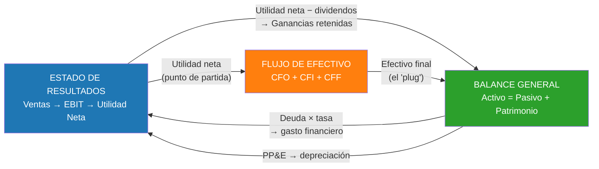

# Semana 8 · Sesión 2: Profundización

## 3. El Estado de Situación Financiera (Balance General)
A diferencia del P&L, el Balance General muestra la situación financiera de la empresa en un **momento exacto** (ej. "al 31 de diciembre de 2024"). Se rigen por la ecuación contable: $Activo = Pasivo + Patrimonio$.

Las cuentas en el Balance General se ordenan por su **liquidez** (qué tan rápido se convierten en efectivo) en el caso de los activos, y por su **exigibilidad** (qué tan rápido hay que pagarlos) en el caso de los pasivos.

**A. Activos (Lo que la empresa tiene)**
* **Activos Corrientes (Corto Plazo):** Efectivo, Inversiones temporales, Cuentas por Cobrar (clientes que deben), Inventario. (Se convertirán en efectivo en menos de 12 meses).
* **Activos No Corrientes (Largo Plazo):** Propiedad, Planta y Equipo (Maquinaria, edificios neto de depreciación), Activos Intangibles (patentes, goodwill), Inversiones a largo plazo.

**B. Pasivos (Lo que la empresa debe)**
* **Pasivos Corrientes (Corto Plazo):** Cuentas por Pagar (proveedores), préstamos bancarios a corto plazo, impuestos por pagar, parte de la deuda a largo plazo que vence este año.
* **Pasivos No Corrientes (Largo Plazo):** Bonos emitidos a 10 años, hipotecas, préstamos a largo plazo.

**C. Patrimonio (Lo que pertenece a los accionistas)**
* **Capital Social:** Dinero que los accionistas invirtieron comprando acciones.
* **Ganancias Retenidas (Retained Earnings):** Las utilidades netas de toda la historia de la empresa que NO se han pagado como dividendos, sino que se han reinvertido en el negocio.

> **El Puente Vital:** Las Ganancias Retenidas son el punto de unión entre el P&L y el Balance General. Si en 2024 la Utilidad Neta fue de $100, y se pagaron $20 en dividendos, $80 pasan a engrosar la cuenta de Ganancias Retenidas en el Balance General de 2024.

---

## Las líneas del Estado de Resultados y qué mide cada una

No todas las utilidades responden la misma pregunta. Bajar por el P&L es ir despejando capas:

| Nivel | Qué se resta | Qué mide realmente |
|---|---|---|
| **Utilidad bruta** | Costo de ventas | Eficiencia del producto y poder de fijación de precios |
| **EBITDA** | Gastos operativos (sin D&A) | Generación de caja operativa aproximada |
| **EBIT / Utilidad operativa** | Depreciación y amortización | Rentabilidad del negocio **sin** decisiones de financiamiento |
| **EBT** | Intereses | Efecto de la estructura de capital |
| **Utilidad neta** | Impuestos | Lo que queda para los accionistas |

**Por qué el EBIT es la línea favorita del analista.** Es la última que **no depende de cómo se
financió la empresa**. Dos compañías idénticas operativamente, una con deuda y otra sin ella,
tienen el mismo EBIT pero utilidades netas muy distintas. Para comparar la calidad de dos
negocios, se compara arriba; para evaluar el riesgo financiero, se mira abajo.

!!! warning "El EBITDA no es flujo de caja"
    Es la simplificación más peligrosa de las finanzas. El EBITDA ignora tres cosas que
    consumen efectivo real: **impuestos**, **inversión en capital de trabajo** y sobre todo
    **CapEx**.

    Sumar de vuelta la depreciación equivale a fingir que los activos no se desgastan. En una
    empresa intensiva en capital —una minera, una telco, una aerolínea— el CapEx de
    mantenimiento es enorme y perpetuo. Charlie Munger lo resumía preguntando si alguien cree
    de verdad que la depreciación no es un gasto.

    Por eso la Semana 22 construye el **FCFF**, que sí resta CapEx y capital de trabajo, y por
    eso el DCF descuenta flujos, no EBITDA.

---

## Los gastos operativos: dónde mirar las señales

Bajo el epígrafe de gastos operativos se agrupan partidas que cuentan historias muy distintas:

* **Gastos de venta y marketing.** En una empresa en crecimiento son inversión disfrazada de
  gasto; el ratio clave es cuánto cuesta adquirir un cliente frente a lo que ese cliente
  aportará en toda su vida.
* **Gastos de administración (G&A).** Deberían crecer **más despacio** que las ventas: si no,
  no hay apalancamiento operativo y la escala no está funcionando.
* **Investigación y desarrollo.** Bajo NIIF parte puede **capitalizarse** (pasar al balance como
  activo) en lugar de gastarse. Capitalizar infla la utilidad de hoy a costa de amortizaciones
  futuras — comparar el criterio con el de los competidores es obligatorio.
* **Deterioros y partidas no recurrentes.** Se presentan como "extraordinarias", pero cuando una
  empresa tiene cargos extraordinarios **todos los años**, ya no son extraordinarios: son parte
  del negocio.

**El apalancamiento operativo.** Cuanto mayor sea la proporción de costos **fijos** en la
estructura, más amplifica la empresa los cambios en ventas:

$$\text{Apalancamiento operativo} = \frac{\%\Delta EBIT}{\%\Delta \text{Ventas}}$$

Un software con costos casi todos fijos tiene apalancamiento altísimo: cada venta adicional cae
casi entera al EBIT. Una distribuidora con costos casi todos variables, muy bajo. El primero es
espectacular en expansión y letal en recesión.

---

## Cómo se conectan los tres estados financieros

Esta es la idea que hay que llevarse de la semana, porque es el esqueleto de todo modelo
financiero (y del que construirás en la Semana 18):

Los tres enlaces que **siempre** hay que verificar:

1. La **utilidad neta** encabeza el flujo de efectivo y alimenta las ganancias retenidas.
2. El **efectivo final** del flujo es el saldo de caja del balance.
3. El **PP&E** del balance genera la depreciación que aparece en el P&L y se suma de vuelta en
   el flujo.

Si esos tres enlaces están bien montados, el balance cuadra solo. Si no cuadra, uno de ellos
está roto — nunca es un problema de "redondeo".

---
