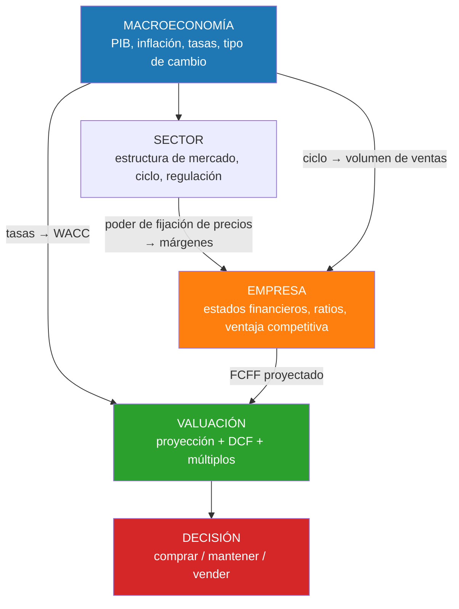

# Semana 10 · Sesión 2: Profundización

## 3. Análisis Financiero Introductorio: Los 4 Pilares
Para empezar a leer la "sangre" de la empresa, usamos los **Ratios Financieros**. Son divisiones entre distintas cuentas que nos dan una métrica estandarizada. (En el Nivel 3 profundizaremos enormemente en esto, pero aquí están las bases):

1. **Ratios de Liquidez (¿Puede pagar sus cuentas mañana?):**
   * *Razón Corriente (Current Ratio):* Activo Corriente / Pasivo Corriente. Si el resultado es > 1, la empresa tiene más activos a corto plazo que deudas a corto plazo. Está sana.
2. **Ratios de Solvencia / Apalancamiento (¿Está ahogada en deudas?):**
   * *Deuda / Patrimonio (Debt to Equity):* Pasivo Total / Patrimonio. Si es 2.0, significa que por cada dólar de los accionistas, hay 2 dólares de deuda bancaria. Un nivel muy alto significa alto riesgo de bancarrota.
3. **Ratios de Rentabilidad (¿Genera dinero?):**
   * *Margen Neto (Net Margin):* Utilidad Neta / Ventas. Si es 10%, significa que de cada $100 vendidos, $10 quedan de utilidad final para los accionistas.
   * *ROE (Return on Equity):* Utilidad Neta / Patrimonio. Mide la rentabilidad del dinero que los accionistas invirtieron. (A mayor ROE, mejores acciones para comprar).
4. **Ratios de Eficiencia (¿Usa bien sus recursos?):**
   * *Días de Cobranza:* Mide cuántos días tardan los clientes en pagar. Si la empresa vende a crédito y los días de cobranza aumentan de 30 a 60 días, es una alerta roja de que el efectivo se está secando.

---

## El marco de análisis integrado: de la macro a la acción

Este es el método que usarás en el proyecto final, y conviene tenerlo explícito desde ahora.
Se recorre **de arriba abajo** (*top-down*), porque cada nivel condiciona al siguiente:

Fíjate en el detalle que casi nadie modela bien: **la macroeconomía entra dos veces**. Una vez
por el numerador (las tasas de interés enfrían la demanda y reducen las ventas proyectadas) y
otra por el denominador (la tasa libre de riesgo sube el WACC y comprime la valuación). Modelar
solo uno de los dos canales subestima sistemáticamente el impacto.

---

## Cómo cada variable macro llega a una línea concreta del estado financiero

| Variable macro | Línea afectada | Mecanismo |
|---|---|---|
| **Crecimiento del PIB** | Ventas | Demanda agregada; amplificado si el bien es cíclico ($E_i > 1$) |
| **Inflación de insumos** | Costo de ventas | Comprime el margen bruto si no hay poder de fijación de precios |
| **Inflación general** | Capital de trabajo | Reponer el mismo inventario físico cuesta más → consume caja |
| **Tasa de interés** | Gasto financiero | Inmediato si la deuda es a tasa variable; diferido si es fija |
| **Tasa de interés** | WACC → valuación | Sube el descuento; golpea más a las empresas de crecimiento |
| **Tipo de cambio** | Ingresos y deuda | Exportadora se beneficia; deuda en dólares se encarece |
| **Desempleo** | Gastos de personal | Mercado laboral tenso → presión salarial |
| **Política fiscal** | Ventas y tasa efectiva | Obra pública, subsidios, cambios impositivos |

**La pregunta que ordena todo el análisis:** ¿esta empresa **absorbe** los shocks macro o los
**traslada**? Una empresa con poder de fijación de precios traslada la inflación de costos al
cliente y protege su margen. Una sin él, lo absorbe y ve caer su rentabilidad. Ese es
exactamente el vínculo entre la elasticidad de la Semana 2 y el margen bruto de la Semana 8.

---

## Las banderas rojas: el checklist del analista

Los indicios de que algo no encaja, en el orden en que conviene revisarlos:

**En el balance:**

* Cuentas por cobrar creciendo **más rápido que las ventas** → problemas de cobro o
  reconocimiento agresivo de ingresos.
* Inventario creciendo más rápido que el costo de ventas → producto que no rota, obsolescencia
  en camino.
* Intangibles y *goodwill* creciendo sin adquisiciones que lo expliquen → capitalización
  agresiva de gastos.
* Deuda de corto plazo creciendo → riesgo de refinanciación en el peor momento.

**En el estado de resultados:**

* Márgenes que mejoran sin explicación operativa.
* Partidas "extraordinarias" que aparecen todos los años.
* Tasa impositiva efectiva anormalmente baja y sin justificar.

**En el flujo de efectivo:**

* CFO sistemáticamente por debajo de la utilidad neta durante varios años.
* CapEx por debajo de la depreciación de forma sostenida.
* Dividendos financiados con deuda nueva en lugar de con flujo operativo.

**En las notas:**

* Cambios de criterio contable (vidas útiles, método de inventario) sin razón de negocio.
* Concentración extrema en un cliente o proveedor.
* Operaciones con partes relacionadas.
* Cambio de auditor sin explicación.

!!! tip "La regla que resume el nivel entero"
    Ninguna de estas señales es prueba de nada por sí sola. **Lo que importa es la
    acumulación y la consistencia entre estados.**

    Una empresa cuyas cuentas por cobrar se disparan *y* cuyo CFO se desploma *y* que cambió de
    auditor el mismo año no está teniendo mala suerte tres veces. Está contando una historia
    que sus propios números contradicen.

---
