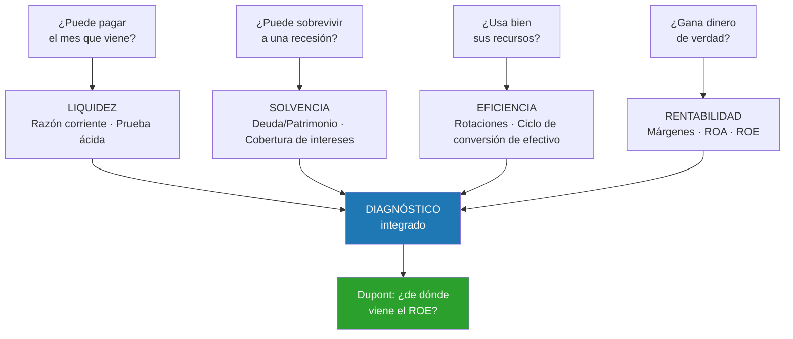

# Semana 21 · Sesión 1: Fundamentos

## 1. Objetivos de la Semana
* Comprender el propósito del análisis de ratios y la importancia del "Benchmarking" (comparación con el sector).
* Calcular e interpretar los 4 pilares del análisis financiero: Liquidez, Solvencia, Rentabilidad y Eficiencia.
* Entender la importancia del **Ciclo de Conversión de Efectivo (CCC)** y su conexión con el Flujo de Caja.
* Detectar "Banderas Rojas" (Red Flags) en estados financieros antes de invertir.

---

## 2. El Primer Mandamiento del Analista: El Benchmarking
Un ratio financiero por sí solo es como saber que tienes 40 de fiebre sin saber cuál es la temperatura normal. Un ratio de Deuda/Patrimonio de 2.0 puede ser letal para una empresa de software, pero es perfectamente normal para una empresa de telecomunicaciones. 
* **Tendencia (Análisis Horizontal):** Comparar el ratio de la empresa hoy vs. hace 3 años. ¿Está mejorando o empeorando?
* **Sector (Análisis Transversal):** Comparar el ratio de la empresa con sus competidores directos en el mismo sector. Nunca compares a Apple con un banco.

---

## Dónde falla el benchmarking en la práctica

El principio es correcto, pero aplicarlo bien exige cuidado con cuatro cosas:

**1. Definir el sector con precisión.** "Retail" agrupa a un supermercado de descuento y a una
marca de lujo, con márgenes que van del 2 % al 60 %. Cuanto más estrecha sea la definición,
más informativa es la comparación.

**2. Ajustar por tamaño y geografía.** Una empresa de $\$500$ M de ventas no es comparable con
una de $\$50.000$ M: tienen distinto poder de negociación con proveedores, distinto acceso al
crédito y distinta escala de costos fijos.

**3. Homogeneizar los criterios contables.** Dos empresas pueden reportar márgenes distintos
solo porque una capitaliza el I+D y la otra lo gasta, o porque valoran el inventario con
métodos diferentes. **Antes de comparar, hay que normalizar.**

**4. Cuidado con el promedio del sector.** Si el sector está atravesando una burbuja, estar "en
la media" no significa estar sano. El benchmarking dice si eres normal, no si eres bueno.

---

## Las cuatro preguntas que ordenan el análisis

Cada familia de ratios responde a una pregunta distinta, y conviene tenerlas presentes como
guion:

**El orden importa.** Una empresa puede ser muy rentable y quebrar por falta de liquidez, pero
no al revés: nadie quiebra por ser demasiado líquido. Por eso el análisis empieza por la
supervivencia y termina por la rentabilidad, no al contrario.

---

## Ratios promedio por sector: la tabla de referencia

Para que los ratios de las próximas sesiones tengan contexto, ten a mano estos órdenes de
magnitud:

| Sector | Margen neto | Rotación activos | D/E | Razón corriente |
|---|---|---|---|---|
| Supermercados | 1-3 % | 2,5-3,5 | 0,8-1,5 | 0,8-1,2 |
| Software / SaaS | 15-30 % | 0,5-0,8 | 0,2-0,6 | 1,5-3,0 |
| Manufactura | 5-10 % | 1,0-1,5 | 0,8-1,5 | 1,5-2,5 |
| Telecomunicaciones | 8-15 % | 0,4-0,6 | **1,5-2,5** | 0,7-1,2 |
| Utilities | 8-12 % | 0,3-0,4 | **1,2-2,0** | 0,8-1,2 |
| Farmacéutica | 15-25 % | 0,5-0,7 | 0,4-0,8 | 1,5-3,0 |
| Bancos | 20-25 % | 0,05-0,1 | **8-12** | n/a |

Dos patrones que conviene interiorizar desde ya:

* **Margen alto ↔ rotación baja**, y viceversa. Son dos estrategias competitivas distintas, y el
  Dupont de la Semana 22 las hará explícitas.
* **Los sectores con flujos muy predecibles** (utilities, telecos) **soportan mucha más deuda**,
  porque pueden comprometerse a pagos fijos con menor riesgo. Un D/E de 2,0 es alarmante en
  software y rutinario en una eléctrica.

---
