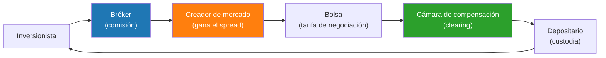

# Semana 29 · Sesión 3: Aplicación Práctica

## 6. Ejercicio Práctico: Leyendo el Libro de Órdenes y el Slippage
Estás operando acciones de "TechFlow". Miras el libro de órdenes de tu plataforma de trading:
* **Compradores (Bid):** 500 acciones a $20.00 | 1,000 acciones a $19.99
* **Vendedores (Ask):** 200 acciones a $20.05 | 2,000 acciones a $20.08

**Escenario A (Orden Límite):** Envías una orden límite para vender 1,000 acciones a $20.00. Tu orden no se ejecuta, sino que pasa a engrosar el lado de los vendedores (Ask) en el libro. No pagas Spread, pero incurres en riesgo de mercado (si el precio baja, no vendiste nada).

**Escenario B (Orden a Mercado):** Necesitas salir apurado. Envías una orden a mercado para **comprar 500 acciones**.
* El sistema cruza tu orden contra el Ask.
* Las primeras 200 acciones se compran a $20.05.
* No hay más volumen a $20.05, por lo que las 300 acciones restantes suben al siguiente nivel: $20.08.
* **Precio Promedio Pagado:** $(200 \times 20.05) + (300 \times 20.08) = 4,010 + 6,024 = \$10,034$.
* *Slippage:* Separaste $10,025 (500 x $20.05) pero gastaste $10,034. El deslizamiento te costó $9 extra. El spread te afectó.

---

## Segundo ejercicio: los costos ocultos de operar

El *slippage* del ejercicio anterior fue de $\$9$. Parece nada. Pongámoslo en contexto con la
factura completa de una operación real.

Un fondo compra **50,000 acciones de TechFlow** (precio de referencia $\$20.05$, valor nocional
$\$1{,}002{,}500$):

| Concepto | Cálculo | Costo |
|---|---|---|
| **Comisión del bróker** | 0,05 % del nocional | $501 |
| **Spread pagado** (media) | $\$0.05/2 \times 50{,}000$ | $1,250 |
| **Impacto de mercado** | ~15 pb en un libro delgado | $1,504 |
| **Impuesto de transacciones** (si aplica) | 0,2 % sobre compras | $2,005 |
| **Costo de oportunidad** (ejecución lenta) | variable | — |
| **Total** | | **$5,260 (52 pb)** |

**Medio punto porcentual antes de que la inversión haga nada.** Y hay que pagarlo otra vez al
vender: **más de 100 pb de ida y vuelta**.

**Por qué importa tanto:** si el fondo rota su cartera 3 veces al año, son
$3 \times 104 = 312$ puntos básicos anuales. **Más del 3 % de rentabilidad consumida en
ejecución**, típicamente más que la comisión de gestión que el cliente ve en su extracto.

Es la razón cuantitativa detrás de una regla de inversión aparentemente aburrida: **operar
menos**. Cada operación tiene que superar un umbral de rentabilidad solo para pagar su propio
costo.

---

## Los tipos de órdenes y cuándo usar cada una

| Orden | Qué garantiza | Qué NO garantiza | Cuándo usarla |
|---|---|---|---|
| **A mercado** | **Ejecución** inmediata | El precio | Urgencia; activos muy líquidos |
| **Límite** | El **precio** máximo/mínimo | Que se ejecute | Cuando el precio importa más que la prisa |
| **Stop (stop-loss)** | Se activa al tocar un nivel | El precio final (se convierte en orden a mercado) | Limitar pérdidas |
| **Stop-limit** | Precio y nivel de activación | La ejecución en un desplome | Control fino |
| **Iceberg** | Oculta el tamaño real | — | Órdenes grandes sin revelar intención |
| **VWAP / TWAP** | Ejecución promediada en el tiempo | El precio final | Volúmenes institucionales |

!!! danger "La trampa del stop-loss en un desplome"
    Un *stop-loss* a $\$18$ no garantiza vender a $\$18$. Cuando se toca ese nivel, la orden se
    convierte en **orden a mercado** y se ejecuta al mejor precio disponible — que en un
    desplome puede estar muy por debajo.

    En el ***Flash Crash*** del 6 de mayo de 2010, el Dow Jones cayó casi 1.000 puntos en
    minutos. Miles de *stop-loss* se dispararon en cascada contra libros de órdenes vacíos, y
    hubo acciones que se ejecutaron a **$\$0.01$**. Muchas operaciones fueron canceladas
    después, pero no todas.

    El *stop-limit* evita ese escenario, a costa de un riesgo distinto: si el precio atraviesa
    tu límite de golpe, **no vendes nada** y te quedas dentro de la caída.

    No existe la orden perfecta: eliges qué riesgo prefieres.

---

## Los intermediarios: quién cobra en cada paso

Entre tu clic y la propiedad de la acción hay una cadena, y cada eslabón cobra:

**El modelo de "comisión cero" y el pago por flujo de órdenes.** Muchos brókeres minoristas no
cobran comisión explícita. Su ingreso viene del ***payment for order flow***: venden tus órdenes
a creadores de mercado mayoristas, que las ejecutan internamente y ganan el *spread*.

No es necesariamente malo —esos creadores suelen ofrecer una pequeña mejora sobre el mejor
precio público— pero conviene entender la ecuación: **si no pagas comisión, el costo está en el
precio de ejecución**, que es mucho menos visible que una línea en el extracto.

**La liquidación T+1.** Desde 2024 en EE. UU. y varios mercados, la liquidación ocurre **un día
hábil** después de la operación. Reduce el riesgo de contraparte y libera garantías, pero exige
a los participantes internacionales resolver la financiación y el cambio de divisa en un plazo
mucho más ajustado.

---
