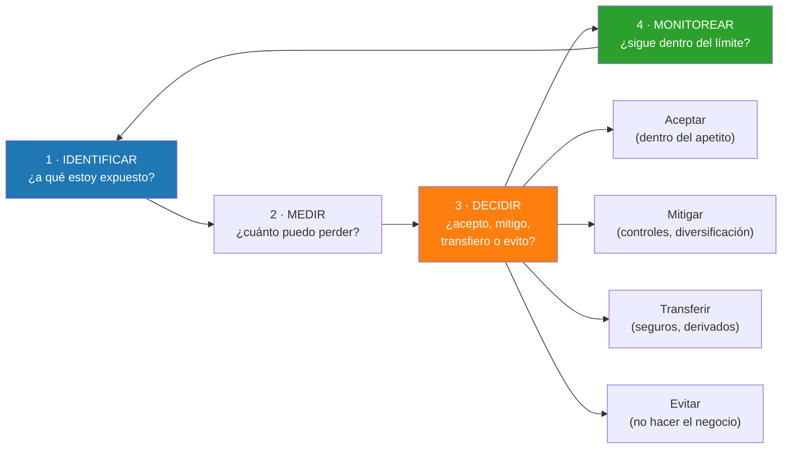

# Semana 31 · Sesión 1: Fundamentos

## 1. Objetivos de la Semana
* Comprender la arquitectura de la Gestión de Riesgos (Risk Management) y el marco de Basilea.
* Identificar y medir el Riesgo de Mercado (Volatilidad y VaR).
* Calcular el Riesgo de Crédito a través de la Pérdida Esperada (PD, LGD, EAD).
* Entender el Riesgo Operativo y por qué es el más difícil de modelar matemáticamente.

---

## 2. La Santísima Trinidad del Riesgo (Marco de Basilea)
El Comité de Basilea (el regulador bancario global) divide el riesgo en tres categorías fundamentales. Un banco sólido debe provisionar capital para soportar pérdidas en estas tres áreas:

### A. Riesgo de Mercado (Market Risk)
Es el riesgo de que las posiciones de trading de la institución pierdan valor debido a movimientos en los mercados financieros.
* **Factores:** Cambios en los precios de las acciones, de las tasas de interés (riesgo de tasa y riesgo de curva), de los tipos de cambio (Forex) o de las materias primas (commodities).
* **Medición Estándar:** El **Value at Risk (VaR)**. El VaR te dice: *"Estoy 99% seguro de que en condiciones normales de mercado, mi portafolio NO perderá más de $X millones en el próximo mes"*. (Lo calcularemos en Excel la próxima semana usando la Distribución Normal de la Semana 15).

---

## Las tres líneas de defensa

El marco de gobernanza del riesgo se organiza en tres capas independientes, y su separación es
tan importante como los modelos:

| Línea | Quién | Función |
|---|---|---|
| **Primera** | Las áreas de negocio (*front office*) | **Asumen** y gestionan el riesgo día a día. Son dueñas de sus riesgos. |
| **Segunda** | Gestión de Riesgos y Cumplimiento | **Vigilan, miden y limitan.** Independientes del negocio, reportan al consejo. |
| **Tercera** | Auditoría interna | **Verifica** que las dos primeras funcionan. Reporta directamente al comité de auditoría. |

**Por qué la independencia es innegociable.** Si quien mide el riesgo depende jerárquicamente
de quien lo asume, el conflicto de interés es evidente: nadie va a reportar que su propio
negocio es peligroso justo antes del reparto de bonos.

Casi todos los grandes desastres operativos comparten el mismo fallo: **la primera y la segunda
línea estaban en la misma persona o en el mismo jefe.** Nick Leeson en Barings controlaba
simultáneamente la mesa de negociación y su liquidación; nadie independiente miraba sus cifras.

---

## El apetito de riesgo: convertir la estrategia en límites

Antes de medir nada hay que decidir **cuánto riesgo se está dispuesto a asumir**. Ese es el
**apetito de riesgo**, lo aprueba el consejo de administración, y se traduce en límites
operativos concretos:

| Nivel | Ejemplo |
|---|---|
| **Declaración de apetito** | "No aceptamos pérdidas anuales superiores al 15 % del capital con un 99 % de confianza" |
| **Límites por tipo de riesgo** | VaR de mercado máximo: $\$50$ M diarios |
| **Límites de concentración** | Ningún deudor puede superar el 5 % de la cartera |
| **Límites operativos** | Stop-loss por mesa, por operador, por instrumento |
| **Umbrales de escalamiento** | Al 80 % del límite se notifica al comité; al 100 % se cierra posición |

**La secuencia lógica del proceso** es siempre la misma, y ninguna etapa se puede saltar:

!!! warning "El riesgo que ningún marco captura del todo"
    Los tres riesgos de Basilea —mercado, crédito, operativo— son los que tienen modelo. Hay
    otros que importan tanto o más y se resisten a la cuantificación:

    * **Riesgo de modelo.** El riesgo de que tu modelo de riesgo esté equivocado. Es
      recursivo y por eso incómodo, pero fue el corazón de 2008: los modelos de las agencias de
      calificación asumían correlaciones que no se cumplieron.
    * **Riesgo de liquidez.** Ser solvente y no poder pagar. Mató a Lehman y a Northern Rock, y
      es el que mide el LCR de la Semana 34.
    * **Riesgo reputacional.** No aparece en ningún balance hasta que aparece en todos.
    * **Riesgo estratégico.** Que el negocio entero deje de tener sentido. Kodak gestionaba
      impecablemente su riesgo de mercado y de crédito mientras la fotografía digital hacía
      irrelevante su modelo.

    Por eso la gestión de riesgos no es un ejercicio matemático: es un ejercicio de
    **imaginación disciplinada** sobre qué puede salir mal.

---
