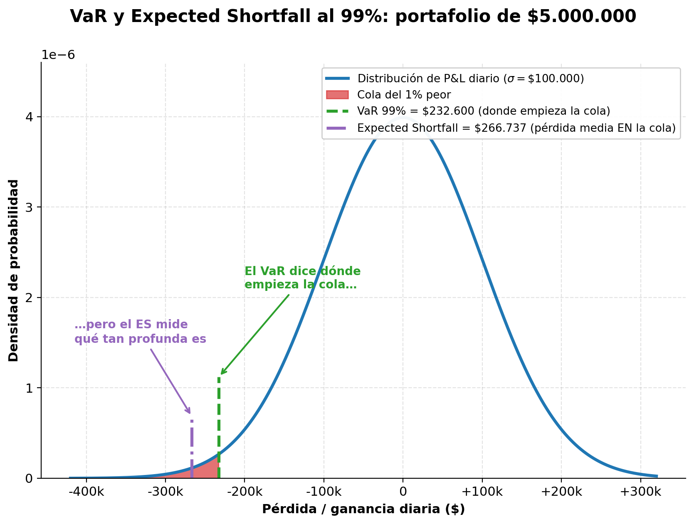

# Semana 32 · Sesión 1: Fundamentos

## 1. Objetivos de la Semana
* Calcular la volatilidad anualizada y diaria de un portafolio en Excel.
* Calcular el Value at Risk (VaR) paramétrico y entender sus limitaciones estructurales.
* Comprender y calcular el Expected Shortfall (CVaR) para eventos de "Cola Gruesa".
* Aplicar el concepto de Beta y Duración para cubrir (Hedging) carteras de acciones y bonos con derivados.

---

## 2. La Volatilidad como Medida Base
La volatilidad es la Desviación Estándar ($\sigma$) de los rendimientos diarios de un activo (visto en la Semana 14). Es el motor de casi todos los modelos de riesgo de mercado.
* **Retorno Diario:** $R_t = \ln(P_t / P_{t-1})$ *(Usamos logaritmos para sumarlos matemáticamente después).*
* **Volatilidad Diaria:** `=DESVEST(rango_retornos)`
* **Volatilidad Anual:** Para comparar riesgos, anualizamos. Como hay ~252 días hábiles bursátiles, multiplicamos la volatilidad diaria por la raíz cuadrada de 252. 
  $$ \sigma_{anual} = \sigma_{diaria} \times \sqrt{252} $$

---

## 3. El Value at Risk (VaR): La métrica fundamental
El VaR responde a la pregunta: *"¿Cuánto dinero perderé como máximo en circunstancias normales de mercado, con un nivel de confianza del 99%, en un horizonte de 1 día?"*

**A. VaR Paramétrico (Asumiendo Distribución Normal):**
Usa la estadística de la Semana 15.
* **Fórmula (Para un nivel de confianza del 99%):**
  $$ VaR = \text{Valor del Portafolio} \times Z \times \sigma_{diaria} $$
  *(Donde $Z$ para 99% de confianza es 2.326).*

**B. VaR Histórico (Sin asumir Distribución Normal):**
No usa fórmulas matemáticas ni la Campana de Gauss. Toma los retornos diarios de los últimos 10 años (ej. 2,520 datos), los ordena de peor a mejor (de menor a mayor), y toma el percentil exacto. El VaR histórico al 99% es el peor día entre el 99% de los mejores días (el día número 25 de la lista de los peores).

> **⚠️ El Fatal Defecto del VaR:** El VaR te dice cuál es tu máxima pérdida en el 99% de los casos. Pero no te dice **qué pasa en ese 1% restante**. Si el VaR es de $1 Millón, en el 1% de los casos pierdes $1 Millón... ¿o pierdes $50 Millones? El VaR no lo sabe. En 2008, los bancos perdieron 10 veces su VaR porque asumió una distribución normal en un mercado que tenía "Colas Gordas" (Fat Tails).

<figure markdown="span">
  
  <figcaption>El VaR marca dónde empieza el peor 1 %; el Expected Shortfall mide la pérdida media dentro de esa cola</figcaption>
</figure>

---
