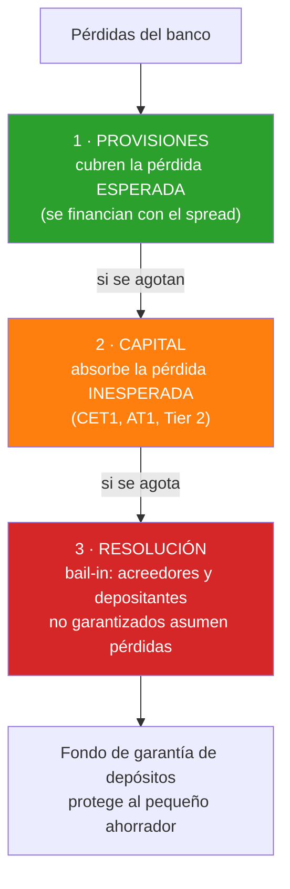

# Semana 34 · Sesión 3: Aplicación Práctica

## 6. Ejercicio Práctico: ¿Pasa el banco "TrustBank" la prueba de Basilea III?
El regulador revisa la bóveda de TrustBank y encuentra lo siguiente:

* **Activos Líquidos de Alta Calidad (HQLA):** 
  * Efectivo en bóveda: $500 Millones
  * Bonos del Tesoro a 1 año: $300 Millones
  * *Total HQLA = $800 Millones*
* **Salidas Netas estimadas de Efectivo en 30 días (si hay pánico):** $700 Millones.

**Cálculo del LCR:**
$$ LCR = \frac{800 \text{ Millones}}{700 \text{ Millones}} = 1.1428 \text{ (114.28\%)} $$

**Veredicto del Regulador:** ¡Aprobado! El LCR es superior al 100%. TrustBank tiene $800M en efectivo listo para soportar una corrida bancaria de $700M en el próximo mes. No necesitará rescates del Banco Central.

**El giro del Stress Testing:**
El regulador aplica un shock: *"Imaginemos que hay una crisis y el rating del país cae, los Bonos del Tesoro que tienes pierden el 20% de su valor y se evaporan de la categoría HQLA"*.
* Nuevo HQLA = Efectivo ($500M) + Bonos desvalorizados al 80% ($240M) = $740M.
* Nuevo LCR = $740M / $700M = 105.7%. 
*Aprobado, pero apenas. El banco recibe una advertencia de liquidez.*

---

## Segundo ejercicio: los ratios de capital, que son otra cosa

El LCR mide **liquidez**. Los ratios de capital miden **solvencia**. Un banco puede aprobar uno
y suspender el otro, y confundirlos es un error de principiante.

TrustBank presenta este balance:

| Activo | Monto | Ponderación por riesgo | **APR** |
|---|---|---|---|
| Efectivo y reservas en banco central | 500 | 0 % | 0 |
| Bonos soberanos AAA | 300 | 0 % | 0 |
| Hipotecas residenciales | 2,000 | 35 % | 700 |
| Préstamos a empresas (rating BBB) | 1,500 | 100 % | 1,500 |
| Préstamos al consumo sin garantía | 700 | 75 % | 525 |
| **Total activos** | **5,000** | | **APR = 2,725** |

Su capital: **CET1 (capital ordinario) = $\$300$ M** y **AT1 = $\$50$ M**.

**Paso 1 — Ratio CET1**

$$CET1 = \frac{300}{2{,}725} = \mathbf{11.0\%}$$

**Paso 2 — Comparación con los mínimos de Basilea III**

| Requisito | Mínimo | TrustBank |
|---|---|---|
| CET1 mínimo | 4,5 % | ✅ 11,0 % |
| + Colchón de conservación | 2,5 % | |
| **CET1 con colchón** | **7,0 %** | ✅ |
| + Colchón anticíclico (0-2,5 %) | variable | |
| Capital total (CET1+AT1+T2) | 8,0 % | ✅ |

**Aprobado con holgura.**

**Paso 3 — El ratio de apalancamiento, la red de seguridad**

Aquí está el detalle importante. El ratio de capital **depende de las ponderaciones de riesgo**,
y esas ponderaciones las calculan en buena medida los propios bancos con sus modelos internos.
Un banco puede parecer muy capitalizado simplemente concentrándose en activos de baja
ponderación.

Por eso Basilea III añadió un ratio **no ponderado**:

$$\text{Ratio de apalancamiento} = \frac{\text{Capital Tier 1}}{\text{Exposición total}} = \frac{350}{5{,}000} = \mathbf{7.0\%}$$

El mínimo es del **3 %**. TrustBank también lo cumple.

!!! danger "Por qué hizo falta un ratio no ponderado"
    Antes de 2008, con Basilea II, los grandes bancos europeos exhibían ratios de capital
    ponderado del 10-12 % **con apalancamientos reales de 30 a 50 veces**. ¿Cómo?

    Concentrándose en activos con ponderación cero o baja: deuda soberana (0 %) y tramos
    "AAA" de titulizaciones hipotecarias. En el papel, esos activos no consumían capital. En la
    realidad, fueron exactamente los que explotaron.

    **Deutsche Bank en 2008** tenía un ratio de capital regulatorio aparentemente sólido y un
    apalancamiento efectivo superior a 50×: bastaba una caída del 2 % en el valor de sus activos
    para borrar todo su patrimonio.

    El ratio de apalancamiento no ponderado es deliberadamente tosco —trata igual a un bono del
    Tesoro que a un préstamo basura— y esa es precisamente su virtud: **no se puede optimizar
    con modelos internos.**

---

## Las tres capas de defensa de un banco

Es útil verlas ordenadas, porque cada una absorbe un tipo distinto de pérdida:

**El cambio de doctrina tras 2008** está en la tercera capa. Antes, cuando el capital se
agotaba, el Estado rescataba con dinero público (*bail-out*). Ahora el mecanismo por defecto es
el ***bail-in***: los tenedores de bonos y los depositantes no garantizados asumen pérdidas
**antes** de que intervenga ningún contribuyente.

Esto tiene una consecuencia directa para un analista de renta fija: **la deuda subordinada
bancaria y los bonos AT1 (CoCos) pueden convertirse en acciones o amortizarse a cero** si el
CET1 cae por debajo de un umbral. Ocurrió con Credit Suisse en 2023, donde $\$17$ mil millones
de AT1 se anularon por completo mientras los accionistas todavía recibían algo — invirtiendo el
orden de prelación tradicional y provocando litigios que siguen abiertos.

---
