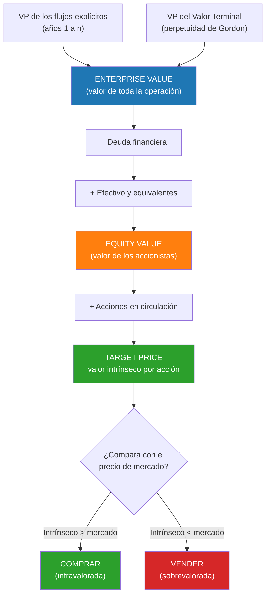

# Semana 37 · Sesión 1: Fundamentos

## 1. Objetivos de la Semana
* Entender la filosofía del Descuento de Flujos de Caja (DCF) como método intrínseco de valuación.
* Calcular el Valor Terminal (TV) usando el Modelo de Crecimiento Perpetuo (Gordon) y el Método de Múltiplos de Salida.
* Integrar el WACC para hallar el Enterprise Value (Valor de la Firma).
* Realizar el "Puente" desde el Enterprise Value hasta el Valor por Acción (Target Price).

---

## 2. La Filosofía del DCF
El DCF se basa en un principio inquebrantable: **Una empresa vale lo que genera en efectivo libre, descontado a su riesgo (WACC).**
No vale lo que dice la prensa, ni lo que cotiza hoy, ni lo que dice su balance. Vale el Valor Presente de sus Flujos de Caja Libre futuros (FCFF).

**La Estructura Matemática del DCF:**
$$ \text{Valor de la Empresa (EV)} = \sum_{t=1}^{n} \frac{FCFF_t}{(1 + WACC)^t} + \frac{\text{Valor Terminal (TV)}}{(1 + WACC)^n} $$

El DCF se divide en dos partes:
1. **Período Explícito:** Los próximos 5 a 10 años, donde modelas el P&L, Balance y Flujo de Efectivo detalle por detalle (Semana 18).
2. **Valor Terminal (TV):** El valor de la empresa desde el año 10 hasta el infinito. Matemáticamente, no puedes proyectar 10,000 años en Excel. Calculas un "valor de cierre" al final del año 5 o 10.

> **💥 La realidad de Wall Street:** El Valor Terminal suele representar entre el 60% y el 80% del Valor Total de la Empresa. Esto significa que la valuación DCF es extremadamente sensible a los supuestos del Valor Terminal. Un pequeño cambio en la tasa de crecimiento a perpetuidad cambia el valor de la empresa por miles de millones.

---

## 3. Estimando el Valor Terminal (TV)
Existen dos métodos para calcular el Valor Terminal. Un buen analista calcula ambos para tener un rango de referencia.

**A. Método de Crecimiento Perpetuo (Modelo de Gordon):**
Asume que la empresa crecerá a una tasa constante ($g$) para siempre. (Conecta con la Semana 13 - Perpetuidades).
* **Fórmula:** 
  $$ TV = \frac{FCFF_{n+1}}{WACC - g} $$
  *(Donde $FCFF_{n+1}$ es el flujo del último año proyectado multiplicado por $(1+g)$).*
* **La Regla de Oro de "g":** La tasa de crecimiento a perpetuidad ($g$) **JAMÁS** puede ser mayor al crecimiento a largo plazo de la economía global (ej. 2% o 3%). Si pones $g$ = 10%, asumirás que la empresa crecerá más rápido que el PIB mundial para siempre, lo cual es matemáticamente absurdo (la empresa acabaría comprando el universo).

**B. Método de Múltiplos de Salida (Exit Multiple):**
Asume que la empresa será vendida al final del año 5 por un múltiplo de mercado razonable.
* **Fórmula:** 
  $$ TV = EBITDA_{año5} \times (\text{Múltiplo EV/EBITDA del sector}) $$
* *Ejemplo:* Si el sector se transa a 8 veces el EBITDA y tu empresa generará $100M de EBITDA en el año 5, el TV será $800M. (Veremos a fondo los múltiplos en la Semana 38).

---

## Del Enterprise Value al precio por acción

El error más común al terminar un DCF es confundir el valor de **la empresa** con el valor de
**las acciones**. El puente entre ambos es este:

**Por qué se resta la deuda:** el Enterprise Value mide lo que vale el negocio completo,
financiado por accionistas *y* acreedores. Los acreedores cobran primero, así que a los
accionistas les corresponde solo lo que queda después de saldar la deuda.
