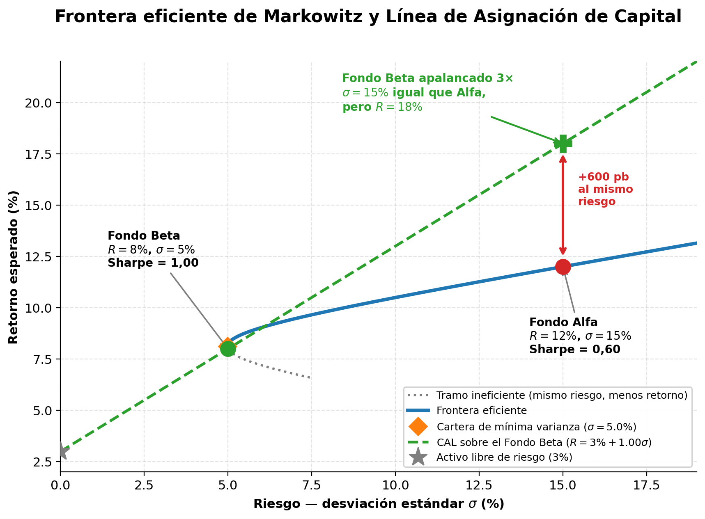

# Semana 39 · Sesión 1: Fundamentos

## 1. Objetivos de la Semana
* Comprender la Teoría Moderna de Portafolios (Markowitz) y la matemática de la Diversificación.
* Diferenciar entre Riesgo Sistemático (de mercado) y Riesgo No Sistemático (específico).
* Entender la Frontera Eficiente y el Ratio de Sharpe (Retorno ajustado por riesgo).
* Distinguir operativamente entre Asset Management (Gestión de Activos) y Wealth Management (Gestión de Patrimonios).

---

## 2. La Matemática de la Diversificación (Markowitz)
El dicho "no pongas todos los huevos en una canasta" es la base de las finanzas modernas. Pero Markowitz fue más allá: demostró que lo que importa no es cuántas canastas tienes, sino **cómo se mueven los huevos entre sí**. 

El motor de la diversificación es la **Correlación ($\rho$)**, que mide cómo se mueven dos activos (de -1 a +1).
* Si dos acciones tienen correlación +1, suben y bajan juntas. Comprar ambas no reduce el riesgo.
* Si tienen correlación -1, cuando una baja, la otra sube. Combinarlas puede eliminar el riesgo matemáticamente.

> **💥 La Regla de Oro de Markowitz:** Combinar activos con baja o negativa correlación reduce la varianza total del portafolio. El riesgo del portafolio siempre será menor que el promedio ponderado de los riesgos individuales. *Esa es la "magia" de la diversificación: obtienes rendimiento "gratis" eliminando volatilidad.*

---

## 3. Riesgo Sistemático vs. Riesgo No Sistemático
Cuando construyes un portafolio, el riesgo total se divide en dos:
1. **Riesgo No Sistemático (Específico):** Es el riesgo de que el CEO de una de tus empresas renuncie, o que una fábrica se incendie. Se **elimina completamente** añadiendo acciones al portafolio (con 20-30 acciones de sectores distintos, este riesgo casi desaparece).
2. **Riesgo Sistemático (De Mercado):** Es el riesgo de que haya una recesión global, una pandemia o una guerra. Afecta a todas las acciones. **No se puede eliminar diversificando**. El mercado solo premia (con mayor retorno) a los inversores por asumir el Riesgo Sistemático (medido por la Beta que vimos en la Semana 24).

---

## 4. La Frontera Eficiente y el Ratio de Sharpe
Markowitz dibujó en un gráfico todas las combinaciones posibles de riesgo (Eje X) vs. retorno (Eje Y). 
* **Frontera Eficiente:** Es la línea curva superior del gráfico. Cualquier portafolio por debajo de esa línea es "ineficiente" porque asumes más riesgo del necesario para ese nivel de retorno. Un buen gestor de fondos siempre busca estar en la Frontera.

Para medir si un portafolio es bueno, no miramos el retorno absoluto, miramos el **Ratio de Sharpe**:
$$ \text{Sharpe} = \frac{R_p - R_f}{\sigma_p} $$
*(Retorno del Portafolio - Tasa Libre de Riesgo) / Volatilidad del Portafolio).*
Te dice cuánto retorno extra generó el gestor por cada unidad de riesgo asumido. Un Sharpe mayor a 1.0 es bueno; mayor a 2.0 es excepcional. (Recuerda el caso del Trader con retornos volátiles de la Semana 14).

<figure markdown="span">
  
  <figcaption>El Fondo Beta apalancado domina al Fondo Alfa: mismo riesgo, 600 puntos básicos más de retorno</figcaption>
</figure>

---
