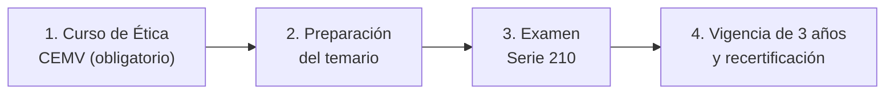

# Nivel 5: Certificación AMIB

Las 40 semanas del curso te dan la base técnica de un analista financiero. Para **asesorar,
promover u operar valores con dinero de terceros en México**, además necesitas un requisito
legal: la **certificación de la AMIB** (Asociación Mexicana de Instituciones Bursátiles).

Este nivel es una guía práctica para obtenerla. No añade teoría nueva, sino que te dice qué
figura presentar, qué trámites hacer, qué partes del curso ya cubren el examen y qué tendrás
que estudiar por tu cuenta.

!!! warning "Verifica siempre la información vigente"
    Los requisitos, precios, temario y formato del examen cambian con el tiempo. Antes de
    inscribirte, descarga la **guía de certificación vigente** en
    [amib.com.mx](https://www.amib.com.mx) y confirma ahí cada dato de esta guía.

---

## 1. Qué figura presentar

La AMIB certifica varias figuras según la actividad que vayas a realizar. Para trabajar como
asesor de inversiones, la indicada es:

> **Figura 3 – Asesor en Estrategias de Inversión (Serie 210)**

Te habilita para asesorar en fondos de inversión, deuda, capital y derivados, y para armar
carteras. Es la más completa y la más demandada por casas de bolsa, bancos y operadoras de
fondos.

| Si tu objetivo es... | Figura recomendada |
|---|---|
| Asesorar clientes y construir carteras con cualquier tipo de valor | **Figura 3 (Serie 210)** |
| Solo vender fondos de inversión | Promotor de Fondos de Inversión (figura más básica) |

Esta guía se centra en la Figura 3, porque es la que mejor aprovecha lo que aprendiste en el
curso (valuación, portafolios, riesgos y derivados).

---

## 2. La ruta en cuatro pasos

1. **Curso de Ética del CEMV (obligatorio).** Te inscribes en el Curso de Ética del Centro
   Educativo del Mercado de Valores, disponible en modalidad presencial y en línea.
2. **Preparación para el examen.** El temario abarca ética, servicios de inversión, marco
   normativo, matemáticas financieras y portafolios, mercado de capitales, títulos de deuda,
   fondos de inversión, derivados, riesgos y análisis económico, financiero y técnico. En
   [Temario vs. curso](temario.md) verás qué semanas del curso cubren cada área.
3. **Examen Serie 210.** Consta de **210 preguntas** y se aprueba con **600 de 1,100 puntos**.
4. **Mantenerla vigente.** La certificación dura **3 años**; después debes recertificarte.

---

## 3. Costos aproximados

| Concepto | Monto aproximado |
|---|---|
| Curso de Ética CEMV (obligatorio) | $1,050 + IVA |
| Material de estudio (guías oficiales o cursos de preparación) | $3,000 a $5,000 |
| Examen Serie 210 | Confirmar con la AMIB |

Hay cursos de preparación de varios proveedores (IMECAF, Bursatron, entre otros), muchos en
línea. Son opcionales: con el curso completo y el plan de [Preparación y trámites](plan_estudio.md)
puedes limitar el gasto a la guía oficial y a simuladores de examen.

---

## 4. Después de certificarte: dónde ejercer

Tienes dos caminos:

* **Dentro de una institución** (casa de bolsa, banco u operadora de fondos). Es la ruta más
  común: la institución se encarga del registro y del marco de cumplimiento.
* **Como asesor independiente.** La CNBV exige la certificación vigente para inscribirte en su
  registro de asesores en inversiones independientes, además de otros requisitos (como
  políticas internas y de prevención de lavado de dinero). Es un trámite aparte que conviene
  revisar directamente con la CNBV.

---

## 5. Contenido de este nivel

* **[Temario vs. curso](temario.md):** cada área del examen, las semanas del curso que la
  cubren y los huecos que tendrás que estudiar fuera.
* **[Preparación y trámites](plan_estudio.md):** un plan de estudio de 12 semanas y la lista de
  trámites desde la inscripción hasta la recertificación.

---

## Fuentes

* [Rankia – Cómo obtener la certificación AMIB](https://www.rankia.mx/blog/como-comenzar-invertir-bolsa/3245308-amib-como-obtener-certificacion)
* [Rankia – Qué es la Figura 3](https://www.rankia.mx/blog/asesoramex/5341400-que-figura-3-certificacion-amib-para-sirve)
* [Asesores de Inversión – Certificación AMIB 2026](https://asesoresinversion.com/academia/finanzas-bursatiles/certificacion-amib/)
* [Omar Educación Financiera – Experiencia certificándose](https://omareducacionfinanciera.com/certificacion-amib/)
